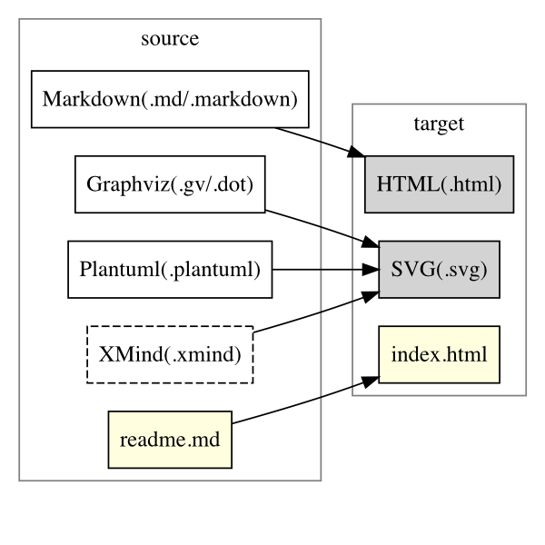

zfinder
=======

zfinder is a simple, powerful, flexible **static server** (B/S structure).

you can setup a static server with markdown support and lots of other features using one command: `$ zfinder serve`

## installation

```shell
$ npm install zfinder -g
```

## usage

### starting a zfinder server

```shell
$ zfinder serve
```

### building files

building is to convert source files of specified formats(Markdown, etc.) into target formats.



build all files in a directory

```shell
$ zfinder build $directory
```

build one file

```shell
$ zfinder build $file
```

### kill all existing zfinder processes

```shell
$ zfinder kill
```

## handlers

handlers are designed to deal with specific urls, or serve as an web API.

### authorization

name | description | supported
-----|-------------|----------
basic-auth | adding basic authorization for urls | yes

### file system

name | description | supported
-----|-------------|----------
explorer      | explores directories like finder.app or explorer.exe  | partly
make-dir      | creating a directory                                  | yes
read-dir      | returning stats of paths in a directory               | yes
read-file     | returning stats and file content                      | yes
remove-path   | removing a path(file or directory)                    | yes
rename-path   | renaming a path(file or directory)                    | yes
write-file    | creating or updating a file                           | yes

### searching

name | description | supported
-----|-------------|----------
content-search           | searching keyword in content of files               | yes
glob-search              | searching with glob expression for path names       | yes
indexed-pathname-search  | searching for path names with indexes               | no
indexed-content-search   | searching keyword in content of files with indexes  | no

### [graphviz](http://www.graphviz.org/) (supporting the DOT language via [viz.js](https://github.com/mdaines/viz.js/))

name | description | supported
-----|-------------|----------
dot-editor    | editing DOT file    | no
dot-previewer | previewing DOT file | yes
dot-renderer  | rendering DOT code  | yes

### [plantUML](http://plantuml.com) (TODO: converting plantUML into DOT using pure javascript version)

name | description | supported
-----|-------------|----------
plantuml-editor    | editing plantuml file    | no
plantuml-previewer | previewing plantuml file | yes
plantuml-renderer  | rendering plantuml code  | yes

### markdown

name | description | supported
-----|-------------|----------
markdown-editor    | editing markdown file    | no
markdown-previewer | previewing markdown file | yes
markdown-renderer  | rendering markdown file  | yes

### xmind

name | description | supported
-----|-------------|----------
xmind-editor    | editing xmind file    | no
xmind-previewer | previewing xmind file | no

### text

name | description | supported
-----|-------------|----------
text-editor | editing text file | partly

### fallback

name | description | supported
-----|-------------|----------
serve-index  | automatically add a suffix to current url if that matches a file            | yes
serve-static | urls that are not processed by other handlers will be pass to `node-static` | yes
